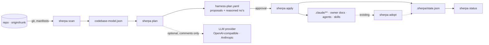

<div align="center">

# Sherpa


**Your repository grows. Your AI agents lose the plot.**

Sherpa analyses your codebase deterministically (like CodeScene) and plans the knowledge architecture for AI assistants from it (like Terraform): owner docs, specialised agents, skills, librarians, evals. You review the plan — Sherpa sets it up after your approval.

[](https://github.com/sherparc/Sherpa/actions/workflows/ci.yml)


</div>

---

## From repo to AI harness in 60 seconds

Live today — real output on a test repo with five Python modules, Django migrations and a test suite
(`active_repo` in [tests/test_plan.py](tests/test_plan.py), frozen as a [golden](tests/goldens/active-console.txt)):

```console
$ sherpa plan .
harness-plan.yaml — 7 proposals, 3 reasoned no's
  + outcome     shop                          mandatory: no harness without an outcome signal (ADR-0008) ✓
  + owner-doc   pay                           24 commits/90d, 1 dependents ✓
  + owner-doc   core                          1 commits/90d, 2 dependents ✓
  + owner-doc   web                           1 commits/90d, 0 dependents ✓
  + agent       pay                           rank 1/4 churn ✓ · 24 commits/90d ✓ · 40 files ✓ · 2 authors ✓
  + test-infra  suite                         26 commits/90d vs. 24 (pay) ✓
  + skill       regenerate-django-migrations  svc/pay/pay/migrations · 6 generated files, 1 configs ✓
  - owner-doc   old                           0 commits/90d, 0 dependents ✗
  - librarian   pay                           rank 1/4 momentum ✓ · 24 commits/30d, 24/90d ✗
  - librarian   core                          rank 2/4 momentum ✓ · 1 commits/30d, 1/90d ✗
  1 dormant units without owner doc (0 commits/90d, 0 dependents): old — the first commit turns them into a proposal.
  not listed, out of reach: 2 units for agent (rank > 1 and < 20 commits/90d), 1 for librarian (rank > 2 and below both floors).
→ .sherpa/harness-plan.yaml
```

Every line can be recomputed: the rank from the ranking in the plan header, the floors from `sherpa.toml [plan]`.
The migrations directory gets no agent but a skill with source, config and command — **generated code is
regenerated, not explained.** Dormant modules and everything out of reach show up in the notes; nothing disappears
silently.

What comes next, once M3 is done (target picture, output not real yet):

```console
$ sherpa apply .           # dry run: shows + ~ = ! per file
$ sherpa apply . --yes     # creates .claude/**, writes .sherpa/state.json
```

- `sherpa scan` 🟢 **Live** — deterministic codebase model (git churn, hotspots, modules, dependencies, generators)
- `sherpa plan` 🟢 **Live** — proposals and reasoned no's with evidence as YAML; decisions survive a re-plan
- `sherpa apply` 🟡 **In progress (M3)** — dry run first, idempotent, state file
- `sherpa status` · `sherpa adopt` ⚪ **Planned (M3)** — detect drift, take over existing harnesses
- `sherpa doctor` ⚪ **Planned (M2b)** — check the environment, update hint

Per command: [docs/scan.md](docs/scan.md), [docs/harness-plan.md](docs/harness-plan.md); milestones: [docs/plan.md](docs/plan.md).

## Quick start

Straight from the repo, no clone (release wheels as the package `sherpa-harness` come with M2b):

```bash
uv tool install git+https://github.com/sherparc/Sherpa.git     # or: pipx install git+https://github.com/sherparc/Sherpa.git
sherpa plan /path/to/repo                                        # scans when needed → .sherpa/harness-plan.yaml
sherpa scan /path/to/repo --out -                                # model only, JSON to stdout
```

For development, the classic way:

```bash
git clone git@github.com:sherparc/Sherpa.git && cd Sherpa
python3 -m venv .venv && .venv/bin/pip install -e ".[dev]"
```

Optional `sherpa.toml` in the target repo:

```toml
[scan]
trunk = "origin/develop"      # otherwise: origin/HEAD, then main/master/dev/develop/trunk
hotspots = 20
generated = ["gen/**"]        # own generator family, extends the built-in ones

[plan]
agent_top = 0.25              # top quartile by commits/90d …
agent_min_commits_90d = 20    # … and floors; all values in docs/harness-plan.md
```

## What the scanner measures

- **T0 git** — trunk detection, commits/authors in 90- and 30-day windows, LOC per file, hotspots (`commits_90d × loc`, generated files excluded), directory churn.
- **T1 modules** — from manifests for .NET (`.csproj`), Python (`pyproject.toml`), Node (`package.json`), Go (`go.mod`), Rust (`Cargo.toml`), Java (`pom.xml`, Gradle); in-repo dependencies in both directions, test modules and `tested_by`, module churn, conventions (languages, CI, containers).
- **Generator families** — EF/Django/Alembic migrations, protobuf, OpenAPI, GraphQL codegen, ResX, `go generate`, snapshots, bundles, lockfiles: per family output, sources, config, central place and regeneration command — by path only, in 30 ms for 15k files.
- **T2 language adapters** (M3b) — anchors and patterns per language; T0/T1 work without them.

All fields are described in the JSON schema: [codebase-model.schema.json](src/sherpa/schemas/codebase-model.schema.json). Details, decisions and interpretation: [docs/scan.md](docs/scan.md).

## What the planner decides

Thresholds are **relative with an absolute floor** — top quartile *and* at least 20 commits, 30 files, 2 authors
for an agent; top 2 by momentum *and* a floor for a librarian. A five-person repo gets an agent, a fifty-module
repo does not get thirty. Every no names what is missing and when it flips. Modules and directories without a
module (`infrastructure/`, `pipelines/`) rank on equal terms; test infrastructure is measured against the most
active business module. Rules, format and configuration: [docs/harness-plan.md](docs/harness-plan.md).

### Determinism guarantees

- Always against `origin/<trunk>`, never against the checked-out `HEAD` (local branches are invisible).
- `as_of` = committer date of the trunk rev → same rev, same model, byte-identical (tested).
- Sorted JSON output, no merge commits in the time windows, no LLM calls in the scanner.

## Why Sherpa

Why not just write a few `.md` files for Claude or Copilot?

- **No more guessing.** Sherpa builds on hard data — commits, authors, LOC, churn — not on gut feeling. Every proposal carries its evidence, every no its reason.
- **Infrastructure as code for knowledge.** `plan` → approval → `apply`, like Terraform. You see every file before it exists; auto-generated markers separate Sherpa's share from yours.
- **Does not wreck your repo.** Deterministic against `origin/trunk`, local branches invisible, idempotent with a state file, existing harnesses are adopted instead of overwritten.
- **Grows with you.** Librarians keep owner docs current, evals come from the dependency graph, and the outcome shows which harness parts really help — nothing on the market does that.

Where the patterns come from:

| Proven on the market | What Sherpa takes from it |
|---|---|
| Terraform `plan` / `apply` / `import` / state | proposal before change, approval, idempotency, `adopt` for existing harnesses |
| CodeScene / Tornhill hotspots | churn × complexity instead of gut feeling; relative thresholds with an absolute floor |
| Backstage catalog / scaffolder | modules as a catalogue, templates with auto-generated markers |
| Renovate | librarians as bots with scope and cadence |
| `brew doctor` | `sherpa doctor` for onboarding |

## Architecture



- Python 3.12, stdlib-first, one runtime dependency (PyYAML for the plan).
- LLMs only in `plan` (stage 2, enriching); scanner and applier stay deterministic.
- Provider layer without LangChain: local vLLM/Ollama/OpenRouter via the OpenAI API plus Anthropic natively.

## Roadmap

| Milestone | Content | Status |
|---|---|---|
| M0–M1a | plan, ADRs, scanner T0+T1, programmatic fixture repos | ✅ |
| M2 | `plan` stage 1: units, rank + floor, generator families → skills, reasoned no's, decision keeping | ✅ |
| M2b | distribution: release wheels, `self-update`, `doctor` | ⏳ |
| M3 / M3b | `apply` (dry run, markers, state), `adopt`, language adapters | 🚧 |
| M4–M7 | auto-evals, outcome evaluation, LLM stage, librarians & multi-repo | ⏳ |

Complete with reasoning: [docs/plan.md](docs/plan.md) · every decision as an ADR: [docs/adr/](docs/adr/README.md)

## License

Proprietary, all rights reserved ([LICENSE](LICENSE)). Everything Sherpa generates in your repo is yours, no strings attached. A source-available licence is planned for the public release (free for individuals and small teams, a company licence above that) — reasoning in [ADR-0010](docs/adr/0010-two-stage-licensing.md).

## Development

```bash
.venv/bin/pytest -q --cov=sherpa       # 173 tests, ~99 % coverage, gate in CI: 90 %
.venv/bin/ruff check . && .venv/bin/ruff format --check .
```

CI runs on Linux and Windows with Python 3.12 and 3.13; macOS is prepared in the matrix and enabled for large changes. Test repos are built programmatically (no corpus in the repo). Working rules for humans and agents: [CLAUDE.md](CLAUDE.md).

`main` changes only through pull requests with squash merge. Once per clone, enable the guard that refuses direct pushes to `main`:

```bash
git config core.hooksPath .githooks
```
