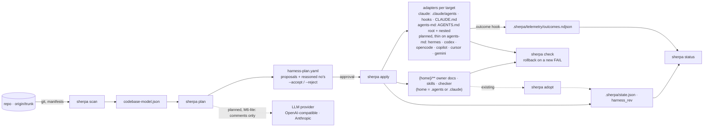

<div align="center">

# Sherpa


**Your repository grows. Your AI agents lose the plot.**

Sherpa analyses your codebase deterministically (like CodeScene) and plans the knowledge architecture for AI assistants from it (like Terraform): owner docs, specialised agents, skills, librarians, evals. You review the plan — Sherpa sets it up after your approval.

Sherpa reads your git history and gives a reason for every proposal — and for every no. It writes into the repository you already have, for the runtimes you already use: Claude Code natively, every `AGENTS.md` reader (Codex, Cursor, Copilot, Gemini CLI, OpenCode, Hermes) through one neutral core, one thin adapter per host on the roadmap.

[](https://github.com/sherparc/Sherpa/actions/workflows/ci.yml)


[](https://github.com/sherparc/Sherpa/releases)

</div>

---

## From repo to AI harness in 60 seconds

Live today — real output on a test repo with five Python modules, Django migrations and a test suite
(`active_repo` in [tests/test_plan.py](tests/test_plan.py), frozen as a [golden](tests/goldens/active-console.txt)):

```console
$ sherpa plan .
harness-plan.yaml — 6 proposals, 4 reasoned no's
  + outcome     shop                          mandatory: no harness without an outcome signal (ADR-0008) ✓
  + owner-doc   pay                           24 commits/90d, 1 dependents ✓ · 40 files ✓
  + owner-doc   core                          1 commits/90d, 2 dependents ✓ · 3 files ✓
  + agent       pay                           rank 1/4 churn ✓ · 24 commits/90d ✓ · 40 files ✓ · 2 authors ✓
  + test-infra  suite                         26 commits/90d vs. 24 (pay) ✓
  + skill       regenerate-django-migrations  svc/pay/pay/migrations · 6 generated files, 1 configs ✓
  - owner-doc   web                           1 commits/90d, 0 dependents ✓ · 3 files ✗
  - owner-doc   old                           0 commits/90d, 0 dependents ✗ · 2 files ✗
  - librarian   pay                           rank 1/4 momentum ✓ · 24 commits/30d, 24/90d ✗
  - librarian   core                          rank 2/4 momentum ✓ · 1 commits/30d, 1/90d ✗
  1 dormant units without owner doc (0 commits/90d, 0 dependents): old — the first commit turns them into a proposal; each is listed above as a no.
  1 small units without owner doc (< 5 files, 0 dependents): web — listed above as no's; owner_doc_min_files in sherpa.toml [plan] moves the floor, a dependent overrides it.
  not listed, out of reach: 2 units for agent (rank > 1 and < 20 commits/90d), 1 for librarian (rank > 2 and below both floors).
→ .sherpa/harness-plan.yaml
```

Every line can be recomputed: the rank from the ranking in the plan header, the floors from `sherpa.toml [plan]`.
The migrations directory gets no agent but a skill with source, config and command — **generated code is
regenerated, not explained.** Dormant modules and everything out of reach show up in the notes; nothing disappears
silently.

Then `sherpa apply` — dry run first, like `terraform plan` (golden [active-apply-console.txt](tests/goldens/active-apply-console.txt)):

```console
$ sherpa apply .
targets: claude, agents-md · home: .agents
sherpa apply — plan origin/main@5db69c4ddd: 10 entries, 5 selected → 18 files
  + .agents/docs/modules/core.md                          owner-doc core                new
  + .agents/docs/modules/pay.md                           owner-doc pay                 new
  + .agents/docs/modules/suite.md                         test-infra suite              new
  + .agents/scripts/sherpa-check.py                       harness                       new
  + .agents/skills/regenerate-django-migrations/SKILL.md  skill regenerate-django-migrations  new
  + .claude/agents/pay.md                                 agent pay                     new
  + .claude/hooks/sherpa-outcome.py                       harness                       new
  + .claude/settings.json                                 harness                       new
  + .claude/skills/regenerate-django-migrations/SKILL.md  skill regenerate-django-migrations  new
  + .sherpa/telemetry/.gitignore                          harness                       new
  + AGENTS.md                                             harness                       new
  + CLAUDE.md                                             harness                       new
  + svc/core/AGENTS.md                                    owner-doc core                new
  + svc/core/CLAUDE.md                                    owner-doc core                new
  + svc/pay/AGENTS.md                                     owner-doc pay                 new
  + svc/pay/CLAUDE.md                                     owner-doc pay                 new
  + tests/suite/AGENTS.md                                 test-infra suite              new
  + tests/suite/CLAUDE.md                                 test-infra suite              new
18 to add, 0 to change, 0 unchanged, 0 skipped.
apply? [y/N] y
check: 0 FAIL, 0 WARN
18 files written · harness_rev c38498363846 → .sherpa/state.json
```

The owner doc under `.agents/` gets a facts block from the scanner (path, LOC, commits, authors, dependencies,
dependents, tests, hotspots — [golden](tests/goldens/active-owner-doc-pay.md)); every module gets a nested
`AGENTS.md` with its facts ([golden](tests/goldens/active-agents-md-pay.md)) — the file Codex, Cursor, Gemini CLI
and Copilot load when they work there — and a `CLAUDE.md` that imports it; the Claude agent gets a knowledge
manifest that points at the owner doc ([golden](tests/goldens/active-agent-pay.md)); the migrations directory
gets its skill; the outcome hook labels every Claude Code execution with the harness version from day one. Run it again: eighteen `=`, `nothing to do.`
Sherpa owns only the marked blocks — write anything else into those files, it stays.

Already have a harness? `sherpa adopt` takes it into the state without changing a byte — like `terraform import`
(golden [active-adopt-console.txt](tests/goldens/active-adopt-console.txt)):

```console
$ sherpa adopt .
sherpa adopt — home .claude · targets claude: 7 harness files
  a .claude/agents/ops.md           agent    no unit matches
  a .claude/agents/pay-expert.md    agent    → agent pay (mentions svc/pay 170×)
  a .claude/docs/modules/pay.md     doc      at sherpa's path, yours — covers the entry
  ? .claude/notes.txt               unknown  yours
  · CLAUDE.md                       root     no sherpa markers — `apply` appends its block (ADR-0016)
gaps:
  - .claude/agents/pay-expert.md: 175 lines, no knowledge manifest — rotation candidate, facts belong in an owner doc
  - .claude/docs/modules/legacy.md: no unit matches by name or path mentions — moved, renamed or not a module doc
state: 6 adopted, 0 rebuilt, 0 kept, 0 dropped · harness_rev 592b1a201d0c → .sherpa/state.json · 2 plan entries covered → .sherpa/harness-plan.yaml
```

The next `sherpa plan` shows `[covered by .claude/agents/pay-expert.md]` on the agent entry and `apply` creates
nothing there ([golden](tests/goldens/active-plan-covered-console.txt)). The same command rebuilds a lost or torn
`.sherpa/state.json` from the files — same `harness_rev` as `apply` wrote (ADR-0017).

- `sherpa scan` 🟢 **Live** — deterministic codebase model (git churn, hotspots, modules, dependencies, generators)
- `sherpa plan` 🟢 **Live** — proposals and reasoned no's with evidence as YAML; decisions survive a re-plan or come from the command line (`--accept agent:pay`)
- `sherpa apply` 🟢 **Live** — dry run first, managed blocks, state file, outcome hook, checker with rollback; targets `claude` and `agents-md` from one neutral core
- `sherpa status` · `sherpa check` 🟢 **Live** — drift per file and block, structural rules, outcome labels per harness version
- `sherpa adopt` 🟢 **Live** — take an existing harness into the state without changing a byte; files that already fill a plan entry cover it, and a nested `AGENTS.md` at a unit's own path is its owner doc (no skeleton next to it); a lost state is rebuilt from the files
- `sherpa doctor` · `sherpa self-update` 🟢 **Live** — every prerequisite with a fix; the next release via the installer that owns this copy; a daily hint that never blocks

Documentation: [docs/index.md](docs/index.md) — [getting started](docs/getting-started.md), one reference page per command ([scan](docs/commands/scan.md), [plan](docs/commands/plan.md), [apply](docs/commands/apply.md), [adopt](docs/commands/adopt.md), [status](docs/commands/status.md), [check](docs/commands/check.md), [doctor](docs/commands/doctor.md), [self-update](docs/commands/self-update.md)), [configuration](docs/reference/configuration.md); milestones: [docs/plan.md](docs/plan.md).

## Quick start

Straight from the repo, no clone — releases are tags with the wheel `sherpa-harness` attached ([releases](https://github.com/sherparc/Sherpa/releases)); `sherpa self-update` fetches the next one:

```bash
uv tool install git+https://github.com/sherparc/Sherpa.git     # or: pipx install …; a tag pins a release: …Sherpa.git@v0.5.0
sherpa doctor                                                    # Python, git, origin, trunk, runtime, layout, nested repositories, install, update — with a fix each
sherpa plan /path/to/repo                                        # scans when needed → .sherpa/harness-plan.yaml
sherpa apply /path/to/repo                                       # dry run, then asks → .claude/**, .sherpa/state.json
sherpa adopt /path/to/repo                                       # an existing harness enters the state, not a byte changes
sherpa status /path/to/repo                                      # drift, checks, outcome labels
sherpa check /path/to/repo                                       # the structural rules alone (also as a deployed copy, no sherpa needed)
sherpa apply /path/to/repo --remove                              # the uninstall: takes back what sherpa wrote and nobody changed
sherpa scan /path/to/repo --out -                                # model only, JSON to stdout
```

For development, the classic way:

```bash
git clone git@github.com:sherparc/Sherpa.git && cd Sherpa
python3 -m venv .venv && .venv/bin/pip install -e ".[dev]"
```

Optional `sherpa.toml` in the target repo:

```toml
[scan]
trunk = "origin/develop"      # otherwise: origin/HEAD, then main/master/dev/develop/trunk
hotspots = 20
generated = ["gen/**"]        # own generator family, extends the built-in ones

[plan]
agent_top = 0.25              # top quartile by commits/90d …
agent_min_commits_90d = 20    # … and floors; all values in docs/reference/configuration.md
```

## What the scanner measures

- **T0 git** — trunk detection, commits/authors in 90- and 30-day windows, LOC per file, hotspots (`commits_90d × loc`, generated files excluded), directory churn.
- **T1 modules** — from manifests for .NET (`.csproj`), Python (`pyproject.toml`), Node (`package.json`), Go (`go.mod`), Rust (`Cargo.toml`), Java (`pom.xml`, Gradle); in-repo dependencies in both directions, test modules and `tested_by`, module churn, conventions (languages, CI, containers).
- **Change coupling** — which modules change together (Tornhill's temporal coupling), measured only on commits below a size cap so squash-merge trunks stay honest; one row in every facts block: `changes together with: core (15 of 24 commits, 62 %)`. Sub-directories per module make a single-package repository a plan with units too.
- **Generator families** — EF/Django/Alembic migrations, protobuf, OpenAPI, GraphQL codegen, ResX, `go generate`, snapshots, bundles, lockfiles: per family output, sources, config, central place and regeneration command — by path only, in 30 ms for 15k files.
- **T2 language adapters** (M3b) — anchors and patterns per language; T0/T1 work without them.

All fields are described in the JSON schema: [codebase-model.schema.json](src/sherpa/schemas/codebase-model.schema.json). Details, decisions and interpretation: [docs/concepts/scan.md](docs/concepts/scan.md).

## What the planner decides

Thresholds are **relative with an absolute floor** — top quartile *and* at least 20 commits, 30 files, 2 authors
for an agent; top 2 by momentum *and* a floor for a librarian. A five-person repo gets an agent, a fifty-module
repo does not get thirty. Every no names what is missing and when it flips. Modules and directories without a
module (`infrastructure/`, `pipelines/`) rank on equal terms; test infrastructure is measured against the most
active business module. Rules, format and configuration: [docs/concepts/harness-plan.md](docs/concepts/harness-plan.md).

### Determinism guarantees

- Always against `origin/<trunk>`, never against the checked-out `HEAD` (local branches are invisible).
- `as_of` = committer date of the trunk rev → same rev, same model, byte-identical (tested).
- Sorted JSON output, no merge commits in the time windows, no LLM calls in the scanner.

## Why Sherpa

Why not just write a few `.md` files for Claude or Copilot?

- **No more guessing.** Sherpa builds on hard data — commits, authors, LOC, churn — not on gut feeling. Every proposal carries its evidence, every no its reason.
- **Infrastructure as code for knowledge.** `plan` → approval → `apply`, like Terraform. You see every file before it exists; Sherpa owns only marked blocks inside the files, the rest is yours and stays yours.
- **Does not wreck your repo.** Sherpa never overwrites what exists — it creates, appends and merges, and rewrites only its own unchanged bytes. Deterministic against `origin/trunk`, local branches invisible, idempotent with a state file, a checker that rolls back a bad write.
- **Measures itself.** Every `apply` installs the outcome hook first: each Claude Code execution gets a label (`success`, `failed`, `unknown`) stamped with the harness version. A harness change has a number to answer to.
- **Grows with you.** Librarians keep owner docs current, evals come from the dependency graph, and the outcome shows which harness parts really help — nothing on the market does that.

Where the patterns come from:

| Proven on the market | What Sherpa takes from it |
|---|---|
| Terraform `plan` / `apply` / `import` / state | proposal before change, approval, idempotency, `adopt` for existing harnesses |
| CodeScene / Tornhill hotspots | churn × complexity instead of gut feeling; relative thresholds with an absolute floor |
| Backstage catalog / scaffolder | modules as a catalogue, templates seeded once |
| `AGENTS.md` / Agent Skills (Codex, Cursor, Gemini CLI, Copilot, …) | proximity loading — the closest file wins — filled with measured facts and kept current instead of hand-written |
| Ansible `blockinfile` | managed blocks inside co-authored files instead of all-or-nothing ownership |
| Renovate | librarians as bots with scope and cadence |
| `brew doctor` | `sherpa doctor` for onboarding |

## Architecture



- Python 3.12, stdlib-first, one runtime dependency (PyYAML for the plan).
- Scanner, planner and applier are deterministic today; no LLM call anywhere in the shipped pipeline.
- Planned (M6-lite): LLMs only in `plan` stage 2, enriching comments, never the entries themselves.
- Planned (M6-lite): a provider layer without LangChain — local vLLM/Ollama/OpenRouter via the OpenAI API plus Anthropic natively.

## Roadmap

| Milestone | Content | Status |
|---|---|---|
| M0 | skeleton, ADRs, the plan | ✅ |
| M1 | scanner T0 for every language: trunk, churn, hotspots, file tree, generated files, JSON schema | ✅ |
| M1a | scanner T1: modules from manifests (6 ecosystems), in-repo deps, `tested_by`, churn per module | ✅ |
| M2 | `plan` stage 1: units, rank + floor, generator families → skills, reasoned no's, decision keeping | ✅ |
| M3a | `apply`: dry run, managed blocks, state, outcome hook, checker with rollback; `status`, `check` | ✅ |
| M3t | target layer: neutral core under `.agents`/`.claude`, adapters `claude` and `agents-md`, nested proximity files | ✅ |
| M3c | `adopt`: existing harnesses taken over unchanged, covered entries, rebuildable state | ✅ |
| M2b | distribution: release wheel per tag, `doctor`, `self-update` (API with a token, `git ls-remote` without), daily hint | ✅ |
| M3d | retro fruit: stamp without rev, sub-units for single-manifest repos, change coupling with a size cap, `plan --accept/--reject`, capped root index | ✅ |
| M3e | review fruit: `status` names a stale plan, `status --json` and `doctor --json`, manifest tie-break by language share, coupling without the root catch-all, sub-units for a dominant root module, proximity-file budgets in the checker | ✅ |
| M3f | write safety: `apply` compares every file with the preview's read before writing, never writes through a symlink, writes each file whole or not at all and rolls back on a write error; `adopt` treats a differing base file as yours, takes a stale plan and rebuilds a torn state without a dead end; a dry run never refuses (two homes → assumes `.agents` and says so) and names a target directory that is a repository of its own | ✅ |
| M3i | the manager sees what exists and takes back what is sherpa's: refuses on a nested repository (`doctor` says it first), a hand-written `covered:` is kept like a decision, the checker fails only in sherpa's own files; `apply` removes a rejected entry's files when they are still sherpa's and `apply --remove` uninstalls — a clean repository is clean again | ✅ |
| M3j | owner docs where the team already writes them: a nested `AGENTS.md` at a unit's own path covers its owner-doc entry — `plan` sets it from the file, `adopt` reports it, `apply` writes the facts block into the team's file and no skeleton next to it (first slice, ADR-0049) | ✅ |
| M3h | `hermes` target: Hermes Agent reads the harness (`AGENTS.md` chain, `.agents/skills`), outcome hook for both runtimes, `doctor` checks for trust and hook wiring | ⏳ |
| M3k | host adapters `codex`, `opencode`, `copilot`, `cursor`, `gemini` — thin on top of `agents-md` like `hermes`: `doctor` names the host, its native rule file only where `AGENTS.md` cannot carry it, the outcome hook where the host has hooks | ⏳ |
| M5 | outcome evaluation: `status` shows labels per `harness_rev` with `n` and the share of `unknown`; a comparison between revisions from 30 labelled executions each | ⏳ |
| M7a | runtime plugins: Sherpa installable inside Claude Code (plugin) and Hermes (bundle) — `/sherpa-plan` with per-entry approval, `/sherpa-apply`, `/sherpa-status`; thin, the CLI does the work | ⏳ |
| M6-lite | provider layer: thin, framework-free — bring your own key, local models via the OpenAI API, Anthropic natively | ⏳ |
| M4 | auto-evals from the dependency graph, `status` with a baseline | ⏳ |
| M6 | `plan` stage 2: LLM enrichment on top of the provider layer | ⏳ |
| M3b | language adapters `dotnet` + `python` (T2: anchors, patterns) | ⏳ |
| M7 | librarians, multi-repo | ⏳ |

Order from here: M3j's second slice → M3h → M3k → M5 → M7a → M6-lite → M4 → M6 → M3b → M7 (plan §7.3, §9, §9.1, §10, §13).

Complete with reasoning: [docs/plan.md](docs/plan.md) · every decision as an ADR: [docs/adr/](docs/adr/README.md)

## Related

| Project | What it is | Where Sherpa differs |
|---|---|---|
| [metaharness](https://github.com/ruvnet/metaharness) | a factory: scaffolds a new, branded agent-harness package (own `npx` CLI, MCP server, signed releases) from a static read of manifests, for ten hosts | Sherpa writes into the repository you have, from its git history, with a reason for every entry and every no, and keeps it current — `adopt`, `status`, outcome labels per harness version |
| Claude Code `/init`, auto-memory · Hermes Agent's self-written skills | the runtimes' own way to grow a harness: LLM prose, per person, unreviewed | facts from `git log`, deterministic, reviewed in the PR like code, per team and repository; runtime-neutral (plan §9) |

## License

Proprietary, all rights reserved ([LICENSE](LICENSE)). Everything Sherpa generates in your repo is yours, no strings attached. A source-available licence is planned for the public release (free for individuals and small teams, a company licence above that) — reasoning in [ADR-0010](docs/adr/0010-two-stage-licensing.md).

## Development

```bash
.venv/bin/pytest -q --cov=sherpa       # 427 tests, ~97 % coverage, gate in CI: 90 %
.venv/bin/ruff check . && .venv/bin/ruff format --check .
```

CI runs with Python 3.12 and 3.13: Linux on every pull request, Linux and Windows on `main`, macOS weekly; a manual run covers all three. Test repos are built programmatically (no corpus in the repo). The repository carries its own harness — `sherpa status .` must be clean before a commit — and an architect agent under [.claude/agents/](.claude/agents/architect.md). Working rules for humans and agents: [CLAUDE.md](CLAUDE.md).

`main` changes only through pull requests with squash merge. Once per clone, enable the guard that refuses direct pushes to `main`:

```bash
git config core.hooksPath .githooks
```
