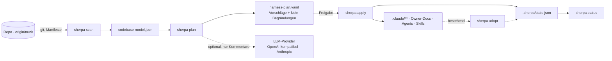

<div align="center">

# Sherpa


**Dein Repository wächst. Deine KI-Agenten verlieren den Überblick.**

Sherpa analysiert deine Codebasis deterministisch (wie CodeScene) und plant daraus die Wissensarchitektur für KI-Assistenten (wie Terraform): Owner-Docs, spezialisierte Agents, Skills, Librarians, Evals. Du prüfst den Plan — Sherpa richtet ihn nach deiner Freigabe ein.

[](https://github.com/sherparc/Sherpa/actions/workflows/ci.yml)


</div>

---

## In 60 Sekunden zum KI-Harness

Heute live — Sherpa scannt sich selbst, echte Ausgabe auf `origin/main`:

```console
$ sherpa scan .
… 20 Hotspots, 1 Module → .sherpa/codebase-model.json
```

So sieht der ganze Weg aus, wenn M3 fertig ist (Zielbild, Ausgabe noch nicht real):

```console
$ sherpa plan .
harness-plan.yaml — 3 Vorschläge, 2 begründete Neins
  + owner-doc  Shop.Pricing        Rang 1/12 Churn ✓ · 214 Commits/90 T ✓
  + agent      Shop.Pricing        Owner-Doc vorhanden ✓ · 5 Autoren ✓
  + test-infra tests/Shop.Tests    mehr Commits als jedes Fachmodul ✓
  - librarian  Shop.Core           Rang 4/12 ✗ · Boden 100 Commits ✗
  - agent      Shop.Reporting      1 Autor ✗ · 9 Commits/90 T ✗

$ sherpa apply .           # Dry-Run: zeigt + ~ = ! je Datei
$ sherpa apply . --yes     # legt .claude/** an, schreibt .sherpa/state.json
```

- `sherpa scan` 🟢 **Live** — deterministisches Codebase-Modell (Git-Churn, Hotspots, Module, Abhängigkeiten)
- `sherpa plan` 🟡 **In Arbeit (M2)** — Vorschläge mit Evidenz und begründeten Neins als YAML
- `sherpa apply` ⚪ **Geplant (M3)** — Dry-Run zuerst, idempotent, State-Datei
- `sherpa status` · `sherpa adopt` ⚪ **Geplant (M3)** — Drift erkennen, bestehende Harnesse übernehmen
- `sherpa doctor` ⚪ **Geplant (M2b)** — Umgebung prüfen, Update-Hinweis

Details je Kommando und die Meilensteine: [docs/plan.md](docs/plan.md).

## Quick Start

Direkt aus dem Repo, ohne Clone (Release-Wheels als Paket `sherpa-harness` kommen mit M2b):

```bash
uv tool install git+https://github.com/sherparc/Sherpa.git     # oder: pipx install git+https://github.com/sherparc/Sherpa.git
sherpa scan /pfad/zum/repo                                       # → /pfad/zum/repo/.sherpa/codebase-model.json
sherpa scan /pfad/zum/repo --out -                               # JSON nach stdout, Zusammenfassung nach stderr
```

Zum Mitentwickeln klassisch:

```bash
git clone git@github.com:sherparc/Sherpa.git && cd Sherpa
python3 -m venv .venv && .venv/bin/pip install -e ".[dev]"
```

Optional `sherpa.toml` im Ziel-Repo:

```toml
[scan]
trunk = "origin/develop"      # sonst: origin/HEAD, dann main/master/dev/develop/trunk
hotspots = 20
generated = ["*.Designer.cs"] # erweitert die eingebaute Liste generierter Dateien
```

## Was der Scanner misst

- **T0 Git** — Trunk-Erkennung, Commits/Autoren in 90- und 30-Tage-Fenstern, LOC je Datei, Hotspots (`commits_90d × loc`, ohne generierte Dateien), Verzeichnis-Churn.
- **T1 Module** — aus Manifesten für .NET (`.csproj`), Python (`pyproject.toml`), Node (`package.json`), Go (`go.mod`), Rust (`Cargo.toml`), Java (`pom.xml`, Gradle); repo-interne Abhängigkeiten in beide Richtungen, Test-Module und `tested_by`, Modul-Churn, Konventionen (Sprachen, CI, Container).
- **T2 Sprach-Adapter** (M3b) — Anker und Muster je Sprache; T0/T1 funktionieren ohne.

Alle Felder sind im JSON-Schema beschrieben: [codebase-model.schema.json](src/sherpa/schemas/codebase-model.schema.json). Details, Entscheidungen und Interpretation: [docs/scan.md](docs/scan.md).

### Determinismus-Garantien

- Immer gegen `origin/<trunk>`, nie gegen den ausgecheckten `HEAD` (lokale Branches sind unsichtbar).
- `as_of` = Committer-Datum des Trunk-Revs → gleicher Rev, gleiches Modell, byte-identisch (getestet).
- Sortierte JSON-Ausgabe, keine Merge-Commits in den Zeitfenstern, keine LLM-Aufrufe im Scanner.

## Warum Sherpa

Warum nicht einfach ein paar `.md`-Dateien für Claude oder Copilot schreiben?

- **Kein Raten mehr.** Sherpa baut auf harten Daten — Commits, Autoren, LOC, Churn — nicht auf Bauchgefühl. Jeder Vorschlag trägt seine Evidenz, jedes Nein seine Begründung.
- **Infrastructure as Code für Wissen.** `plan` → Freigabe → `apply`, wie Terraform. Du siehst jede Datei, bevor sie entsteht; Auto-Generated-Marker trennen Sherpas Anteil von deinem.
- **Zerschiesst dir nicht das Repo.** Deterministisch gegen `origin/trunk`, lokale Branches unsichtbar, idempotent mit State-Datei, bestehende Harnesse werden übernommen statt überschrieben.
- **Wächst mit.** Librarians halten Owner-Docs aktuell, Evals kommen aus dem Abhängigkeitsgraphen, und das Outcome zeigt, welche Harness-Teile wirklich helfen — das gibt es so am Markt nicht.

Woher die Muster kommen:

| Bewährt am Markt | Was Sherpa davon nimmt |
|---|---|
| Terraform `plan` / `apply` / `import` / State | Vorschlag vor Änderung, Freigabe, Idempotenz, `adopt` für bestehende Harnesse |
| CodeScene / Tornhill Hotspots | Churn × Komplexität statt Bauchgefühl; relative Schwellen mit absolutem Boden |
| Backstage Catalog / Scaffolder | Module als Katalog, Templates mit Auto-Generated-Markern |
| Renovate | Librarians als Bots mit Scope und Takt |
| `brew doctor` | `sherpa doctor` für das Onboarding |


## Architektur



- Python 3.12, stdlib-first, eine geplante Laufzeit-Abhängigkeit (PyYAML für den Plan).
- LLMs nur in `plan` (Stufe 2, anreichernd); Scanner und Applier bleiben deterministisch.
- Provider-Schicht ohne LangChain: lokales vLLM/Ollama/OpenRouter über OpenAI-API plus Anthropic nativ.

## Roadmap

| Meilenstein | Inhalt | Stand |
|---|---|---|
| M0–M1a | Plan, ADRs, Scanner T0+T1, programmatische Fixture-Repos | ✅ |
| M2 | `plan` Stufe 1: deterministische Regeln, YAML-Plan, Nein-Begründungen | 🚧 |
| M2b | Distribution: Release-Wheels, `self-update`, `doctor` | ⏳ |
| M3 / M3b | `apply` (Dry-Run, Marker, State), `adopt`, Sprach-Adapter | ⏳ |
| M4–M7 | Auto-Evals, Outcome-Bewertung, LLM-Stufe, Librarians & Multi-Repo | ⏳ |

Vollständig mit Begründungen: [docs/plan.md](docs/plan.md) · jede Entscheidung als ADR: [docs/adr/](docs/adr/README.md)

## Lizenz

Proprietär, alle Rechte vorbehalten ([LICENSE](LICENSE)). Alles, was Sherpa in deinem Repo erzeugt, gehört dir ohne Auflagen. Für den öffentlichen Release ist eine Source-available-Lizenz geplant (frei für Einzelne und kleine Teams, Firmenlizenz darüber) — Begründung in [ADR-0010](docs/adr/0010-lizenz-zweistufig.md).

## Entwicklung

```bash
.venv/bin/pytest -q --cov=sherpa       # 105 Tests, ~99 % Abdeckung, Gate in CI: 90 %
.venv/bin/ruff check . && .venv/bin/ruff format --check .
```

CI läuft auf Linux und Windows mit Python 3.12 und 3.13; macOS ist in der Matrix vorbereitet und wird bei grossen Änderungen zugeschaltet. Test-Repos werden programmatisch erzeugt (kein Corpus im Repo). Arbeitsregeln für Menschen und Agenten: [CLAUDE.md](CLAUDE.md).

`main` wird nur über Pull Requests mit Squash-Merge verändert. Einmal pro Clone den Guard aktivieren, der direkte Pushes nach `main` abweist:

```bash
git config core.hooksPath .githooks
```
