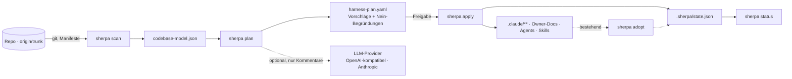

<div align="center">

# Sherpa

**Sherpa liest eine Codebasis wie ein Senior-Engineer und schlägt daraus einen KI-Harness vor — Owner-Docs, Agents, Skills, Librarians, Evals — der erst nach deiner Freigabe angelegt wird.**

[](https://github.com/andreichirila/Sherpa/actions/workflows/ci.yml)


`scan` → `plan` → `apply`, wie `terraform plan/apply` — nur für Wissensarchitektur statt Infrastruktur.

</div>

---

## Was heute funktioniert

Sherpa scannt sich selbst (echte Ausgabe, Stand `origin/main` `9612f03`):

```console
$ sherpa scan . --no-fetch --out -
… 20 Hotspots, 1 Module → -
```

```jsonc
{
  "git": {
    "trunk": { "ref": "origin/main", "source": "candidate", "rev": "9612f03…" },
    "commits_total": 4,
    "hotspots": [
      { "path": "docs/plan.md",                 "commits_90d": 4, "loc": 238, "score": 952 },
      { "path": "src/sherpa/scan/t1_modules.py", "commits_90d": 2, "loc": 449, "score": 898 }
    ]
  },
  "modules": [
    { "id": "sherpa", "kind": "python", "loc": 3129, "test_files": 8, "tested_by": [] }
  ],
  "conventions": { "ci": [".github/workflows/ci.yml"], "languages": { "python": 2027, "markdown": 602, "…": 0 } }
}
```

| Kommando | Stand | Was es tut |
|---|---|---|
| `sherpa scan <repo>` | ✅ fertig | Deterministisches Codebase-Modell (`.sherpa/codebase-model.json`, Schema v2) |
| `sherpa plan <repo>` | 🚧 M2, in Arbeit | Harness-Vorschläge mit Evidenz und Nein-Begründungen als YAML |
| `sherpa apply <repo>` | ⏳ M3 | Freigegebenen Plan anlegen — Dry-Run als Default, idempotent, State-Datei |
| `sherpa status <repo>` | ⏳ M3 | State gegen Dateisystem prüfen (Drift) |
| `sherpa adopt <repo>` | ⏳ M3 | Bestehenden Harness übernehmen statt überschreiben |
| `sherpa doctor` | ⏳ M2b | Umgebung prüfen (Git, Trunk, Provider, Update) |

`plan`, `apply` und `status` sind heute Platzhalter und beenden mit Exit-Code 2. Die Meilensteine stehen in [docs/plan.md §3](docs/plan.md).

## Quick Start

Noch keine Release-Wheels (kommen mit M2b); Installation aus dem Repo:

```bash
git clone git@github.com:andreichirila/Sherpa.git && cd Sherpa
python3 -m venv .venv && .venv/bin/pip install -e ".[dev]"
.venv/bin/sherpa --version
```

Erstes Ergebnis in unter einer Minute — irgendein Repo mit einem `origin`-Remote:

```bash
.venv/bin/sherpa scan /pfad/zum/repo            # → /pfad/zum/repo/.sherpa/codebase-model.json
.venv/bin/sherpa scan /pfad/zum/repo --out -    # JSON nach stdout, Zusammenfassung nach stderr
```

Optional `sherpa.toml` im Ziel-Repo:

```toml
[scan]
trunk = "origin/develop"      # sonst: origin/HEAD, dann main/master/dev/develop/trunk
hotspots = 20
generated = ["*.Designer.cs"] # erweitert die eingebaute Liste generierter Dateien
```

## Was der Scanner misst

- **T0 Git** — Trunk-Erkennung, Commits/Autoren in 90- und 30-Tage-Fenstern, LOC je Datei, Hotspots (`commits_90d × loc`, ohne generierte Dateien), Verzeichnis-Churn.
- **T1 Module** — aus Manifesten für .NET (`.csproj`), Python (`pyproject.toml`), Node (`package.json`), Go (`go.mod`), Rust (`Cargo.toml`), Java (`pom.xml`, Gradle); repo-interne Abhängigkeiten in beide Richtungen, Test-Module und `tested_by`, Modul-Churn, Konventionen (Sprachen, CI, Container).
- **T2 Sprach-Adapter** (M3b) — Anker und Muster je Sprache; T0/T1 funktionieren ohne.

Alle Felder sind im JSON-Schema beschrieben: [codebase-model.schema.json](src/sherpa/schemas/codebase-model.schema.json). Details, Entscheidungen und Interpretation: [docs/scan.md](docs/scan.md).

### Determinismus-Garantien

- Immer gegen `origin/<trunk>`, nie gegen den ausgecheckten `HEAD` (lokale Branches sind unsichtbar).
- `as_of` = Committer-Datum des Trunk-Revs → gleicher Rev, gleiches Modell, byte-identisch (getestet).
- Sortierte JSON-Ausgabe, keine Merge-Commits in den Zeitfenstern, keine LLM-Aufrufe im Scanner.

## Warum Sherpa

| Bewährt am Markt | Was Sherpa davon nimmt |
|---|---|
| Terraform `plan` / `apply` / `import` / State | Vorschlag vor Änderung, Freigabe, Idempotenz, `adopt` für bestehende Harnesse |
| CodeScene / Tornhill Hotspots | Churn × Komplexität statt Bauchgefühl; relative Schwellen mit absolutem Boden |
| Backstage Catalog / Scaffolder | Module als Katalog, Templates mit Auto-Generated-Markern |
| Renovate | Librarians als Bots mit Scope und Takt |
| `brew doctor` | `sherpa doctor` für das Onboarding |

Was es so am Markt nicht gibt: Evals aus dem Abhängigkeitsgraphen ableiten und aus dem Outcome lernen, welche Harness-Teile wirklich helfen ([docs/plan.md §2.4–2.5](docs/plan.md)).

## Architektur



- Python 3.12, stdlib-first, eine geplante Laufzeit-Abhängigkeit (PyYAML für den Plan).
- LLMs nur in `plan` (Stufe 2, anreichernd); Scanner und Applier bleiben deterministisch.
- Provider-Schicht ohne LangChain: lokales vLLM/Ollama/OpenRouter über OpenAI-API plus Anthropic nativ.

## Roadmap

| Meilenstein | Inhalt | Stand |
|---|---|---|
| M0–M1a | Plan, ADRs, Scanner T0+T1, programmatische Fixture-Repos | ✅ |
| M2 | `plan` Stufe 1: deterministische Regeln, YAML-Plan, Nein-Begründungen | 🚧 |
| M2b | Distribution: Release-Wheels, `self-update`, `doctor` | ⏳ |
| M3 / M3b | `apply` (Dry-Run, Marker, State), `adopt`, Sprach-Adapter | ⏳ |
| M4–M7 | Auto-Evals, Outcome-Bewertung, LLM-Stufe, Librarians & Multi-Repo | ⏳ |

Vollständig mit Begründungen: [docs/plan.md](docs/plan.md) · jede Entscheidung als ADR: [docs/adr/](docs/adr/README.md)

## Entwicklung

```bash
.venv/bin/pytest -q --cov=sherpa       # 105 Tests, ~99 % Abdeckung, Gate in CI: 90 %
.venv/bin/ruff check . && .venv/bin/ruff format --check .
```

CI läuft auf Linux und Windows mit Python 3.12 und 3.13; macOS ist in der Matrix vorbereitet und wird bei grossen Änderungen zugeschaltet. Test-Repos werden programmatisch erzeugt (kein Corpus im Repo). Arbeitsregeln für Menschen und Agenten: [CLAUDE.md](CLAUDE.md).
