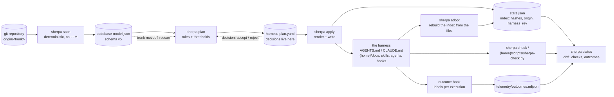

# 00 · The pipeline: from a repository to a harness and back

Owner: [concepts/harness-apply](../concepts/harness-apply.md), [plan §2](../plan.md). Every box is one command;
every cylinder is one file under `.sherpa/`; the harness is the only thing a human or an agent edits.

What to remember:

- **Left of `apply` nothing touches the user's repository**; `scan` and `plan` write only under `.sherpa/`.
- **The plan is the contract** (Terraform's saved plan, ADR-0019): `apply` refuses one whose trunk moved.
- **The harness files are the truth, the state is an index over them** (ADR-0017): lose the state, run `adopt`.
- **The loop closes through the hook**: labels carry the `harness_rev` they ran under, so a harness change can
  be measured (M5).
