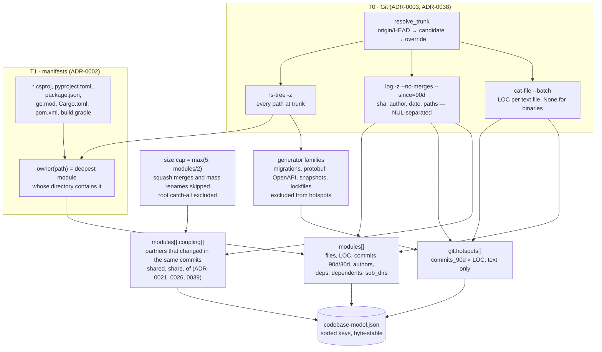

# 01 · Scan: two tiers of facts, one model

Owner: [concepts/scan](../concepts/scan.md). T0 needs only Git and works on every repository; T1 needs
manifests and gives module boundaries; language adapters (M3b) would be a T2 and are not built.

What to remember:

- **Measured against `origin/<trunk>`, never `HEAD`** — a local branch or a dirty worktree changes nothing.
- **Coupling's denominator is the measured commits**, not `commits_90d`: the row in an owner doc prints both
  numbers it was computed from (`6 of 12 measured commits, 50 %`).
- **Unusual paths are data, not quoting**: `-z` everywhere, so `über.py` in `log` equals `über.py` in `ls-tree`.
