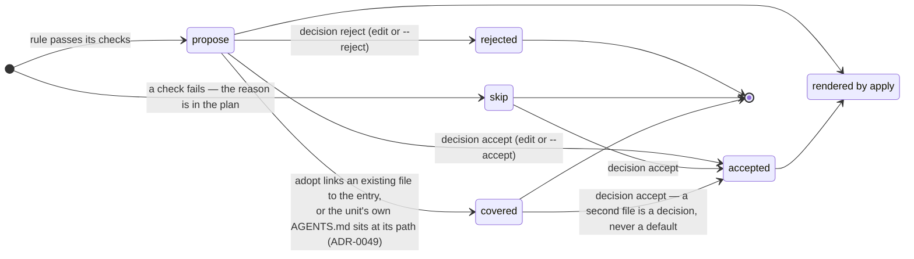
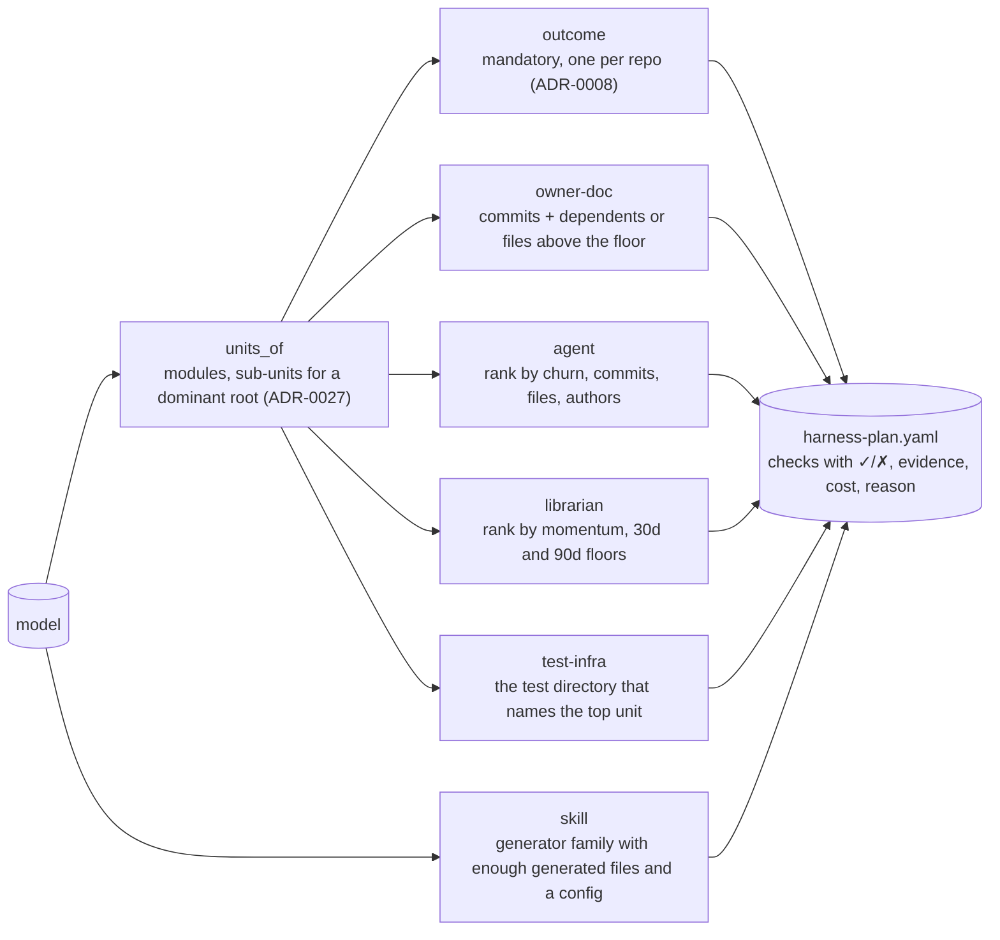

# 02 · Plan entries: proposal, decision, coverage, selection

Owner: [concepts/harness-plan](../concepts/harness-plan.md), ADR-0005 (format), ADR-0007 (covered), ADR-0019
(stale plan). The plan is Terraform's model: every proposal unless rejected, every reasoned no unless accepted.

`selected()` in one line: `decision == accept` **or** (`default == propose` **and** `decision != reject` **and**
not `covered`). Decisions survive a re-plan (`merge_decisions`); `covered` is recomputed from the state on every
plan.

The entry kinds and where their evidence comes from:

What to remember:

- **Every no has a reason** in the file; a plan a human cannot argue with is not a plan.
- **A typo is refused, not interpreted**: `decision: rejcet` fails validation on every reader (ADR-0042).
- **`apply` refuses a stale plan; `adopt` does not** (ADR-0034) — import needs the resource, not a fresh plan.
