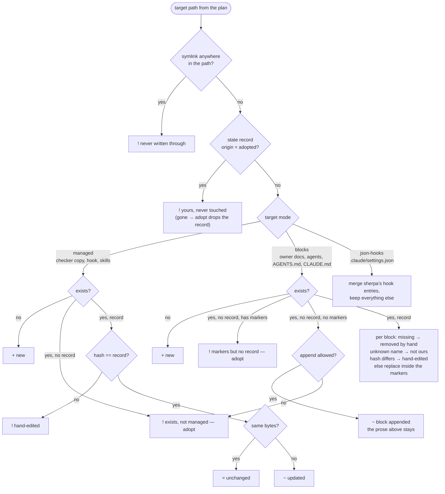

# 03 · Ownership: what `apply` does with a file it meets

Owner: [commands/apply](../commands/apply.md), ADR-0013 (blocks and managed files), ADR-0016 (never
overwrite, only add), ADR-0031 (symlinks), ADR-0033 (base files after adopt). The state record is the only
memory; without one, every byte on disk is somebody's.

What to remember:

- **Three verdicts, no fourth**: `+` create, `~` rewrite only sherpa's own unchanged bytes, `!` leave it — and
  say why. There is no `--force`; the way to a fresh copy is delete and `apply`.
- **Adopted means yours forever** until you delete the file; `apply` will not even report drift on it.
- **Per-block ownership** lets a hand-edited `facts` block coexist with a regenerated `graph` block in one file.
