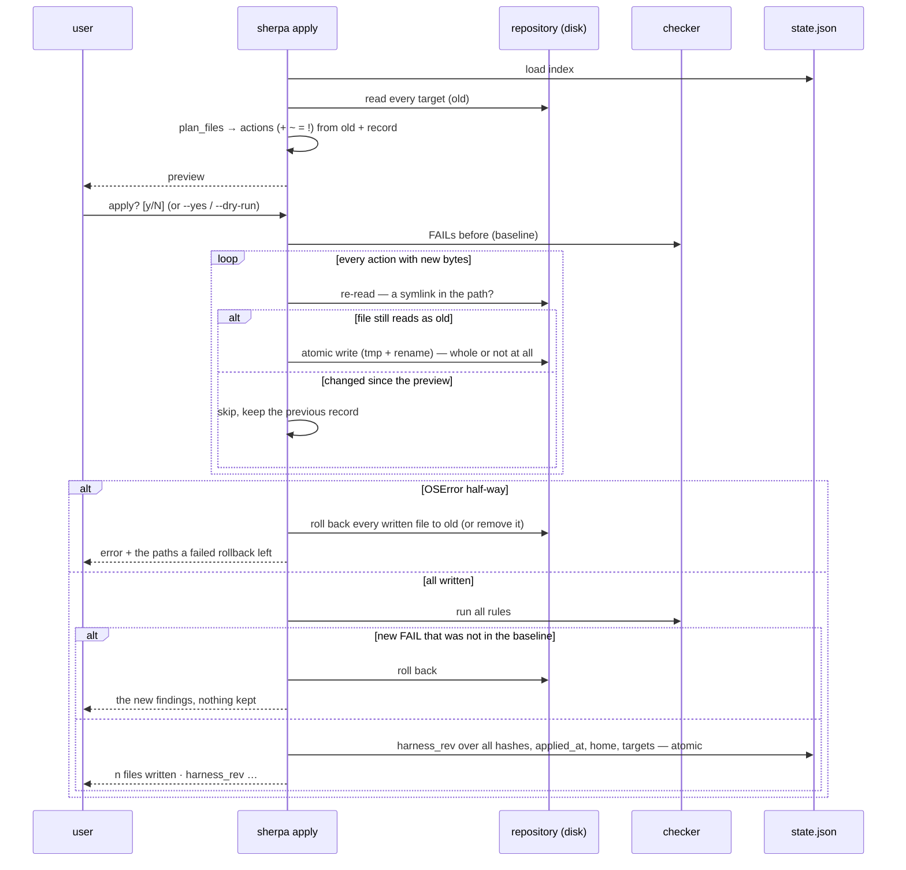

# 04 · The write path: preview, confirm, compare-and-swap, atomic, rollback

Owner: ADR-0030 (compare before the swap), ADR-0031 (symlinks), ADR-0032 (atomic writes and rollback),
ADR-0017 (index files through `sherpa.atomic`). Between the preview and the write sits a human — and possibly
an editor, a second agent, a `git pull`.

What to remember:

- **`new` was computed from `old`**; if the file is not `old` any more, writing `new` would destroy a stranger's
  bytes. The check is a byte comparison, not a lock — two concurrent `apply` runs skip each other's files.
- **A rollback restores only what this run wrote**; a file skipped since the preview is never touched.
- **The checker is the last gate**: a harness that fails C1–C6 is not written, even after a confirmation.
