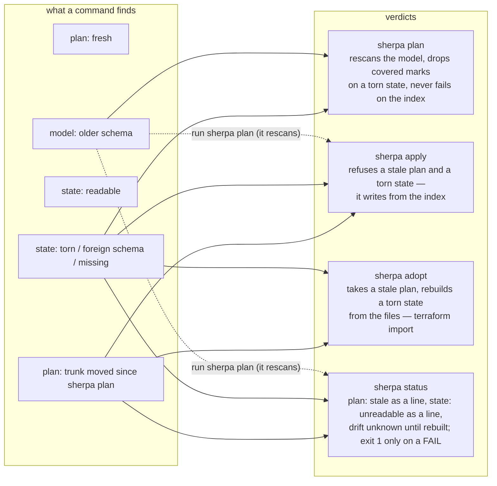
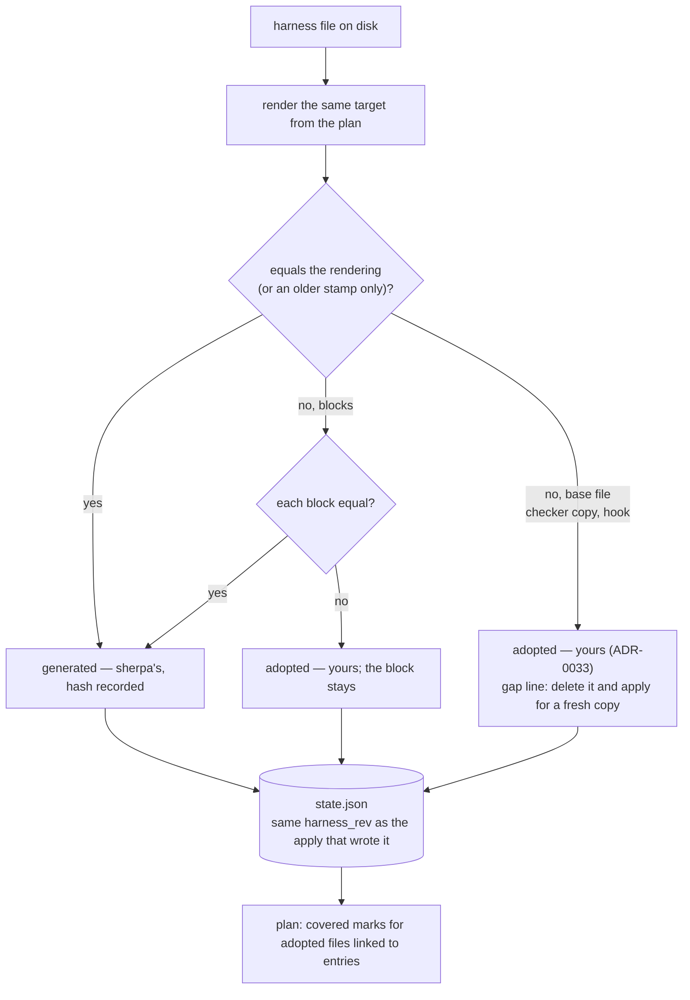

# 05 · State and recovery: the index, and what happens when it is wrong

Owner: ADR-0017 (rebuildable index), ADR-0019 (stale plan), ADR-0034 (no dead end), ADR-0033 (base files after
adopt). Three files can go bad independently; the table below is what each command does with each.

The rebuild itself, file by file:

What to remember:

- **No second way to recover**: `adopt` is the rebuild, `plan` is the rescan; nothing else repairs anything.
- **A rebuild cannot tell a hand edit from an old copy**, so it errs towards yours (ADR-0016 over freshness).
- **The dead end is closed**: torn state plus moved trunk was `plan` → "run adopt", `adopt` → "run plan";
  now `adopt` ignores staleness and `plan` ignores the index it does not own.
