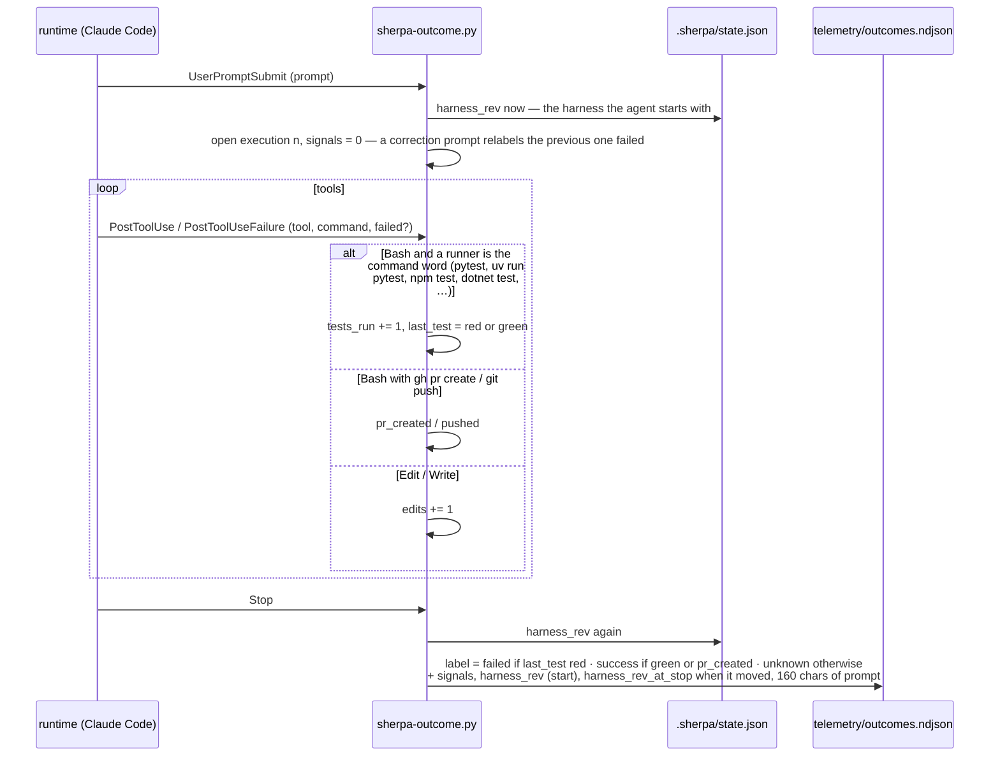

# 06 · The outcome hook: from tool events to one label per execution

Owner: [commands/apply — the outcome hook](../commands/apply.md#the-outcome-hook), ADR-0008 (the minimum),
ADR-0028 (the denominator for M5), ADR-0040 (test runs as command words, the start revision). Stdlib, fail-open,
never prints; one execution is one prompt until the next Stop.

What to remember:

- **`unknown` is honest; a false `success` is a wrong number** — hence a runner counts only as the command
  word, never as a word in `cat pytest.ini`.
- **The label belongs to the harness the execution started under**; an `apply` inside the run is recorded as a
  second revision and such records leave the M5 comparison.
- **Nothing leaves the machine**: the ignore file next to the ndjson keeps it out of Git.
