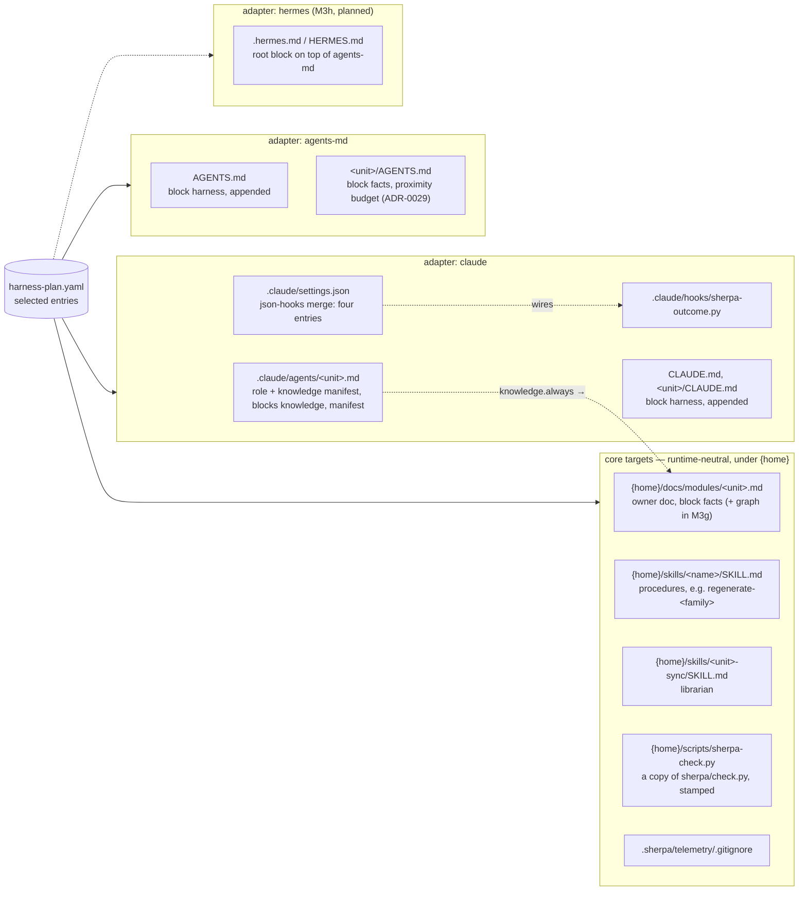

# 07 · Runtimes: one neutral core, one adapter per target

Owner: ADR-0015 (core under `home`, adapters), ADR-0023 (the `hermes` target, M3h), ADR-0024 (runtime
plugins, M7a). `home` is `.claude` when Claude Code is the runtime, `.agents` otherwise; a new runtime is a new
adapter in `apply/render.py`, never a change to the core.

What to remember:

- **Facts live once, in the owner doc**; agents carry a role and a manifest that points at facts, never facts.
- **Outcome labels need a runtime with hooks**; `apply` says so when `claude` is not among the targets.
- **Both homes present and nothing decided** → `apply` asks on a terminal and refuses otherwise; `sherpa.toml
  [apply]` beats the state beats detection.
