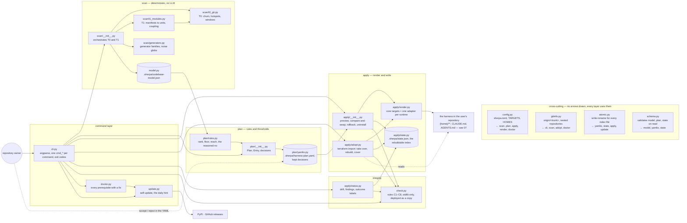

# 08 · Modules: the source tree of `src/sherpa/` and who calls whom

Owner: [plan §2](../plan.md) (architecture), the docstring at the top of each module (its job), ADR-0003
(measurements through `gitinfo`), ADR-0004 (model access only through `sherpa/llm/`, not yet a module),
ADR-0015 (runtime adapters in `render.py`), ADR-0017 (index files through `atomic`), ADR-0042 (schema
validation on every reader). One box per module; the arrows are imports that carry a call, not every import.
The other pages show the mechanics; this one shows where each mechanic lives.

What to remember:

- **`check.py` imports nothing from the package**: it is copied into `{home}/scripts/sherpa-check.py` and runs
  under `python -I -S`; everything else may import it. The one exception is the deployed copy handing over to
  an installed, never older `sherpa.check` when it finds one.
- **Every Git measurement goes through `gitinfo`** (ADR-0003), every index file through `atomic` (ADR-0017),
  every read of a `.sherpa/` file through `schema` (ADR-0042) — three modules, three invariants.
- **`render.py` is the only place that knows a runtime** (ADR-0015): the core targets and both adapters,
  `claude` and `agents-md`, are equal citizens there; the core, `apply` and `adopt` see only `home`.
- **`cli.py` composes, it does not compute**: parsing, the questions on a terminal, exit codes — the result of
  a command is built in its module and rendered there (`apply.render_result`, `status.render`).
